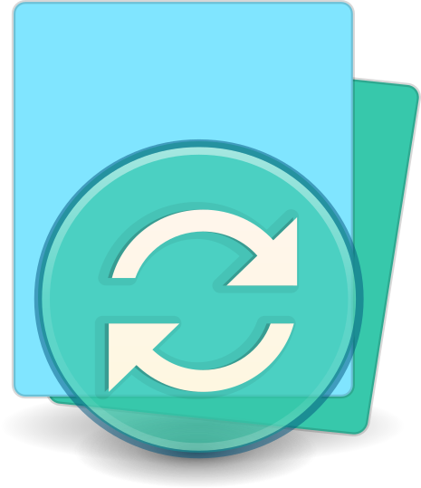
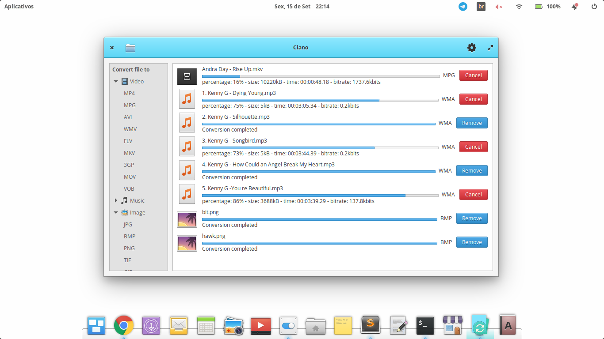

<div align="center">
  
  <h1 align="center">Ciano</h1>
  <h3 align="center">A simple multimedia file converter.</h3>
  <a href="https://appcenter.elementary.io/com.github.robertsanseries.ciano" target="_blank">
    
    </a>
</div>

<br/>


<p align="center">
     <br>
  <a href="https://github.com/robertsanseries/ciano/issues/new"> Report a problem! </a>
</p>

<div class="center">
  <h1 align="center"> Informations </h1>
</div>

### Website

- [Visit website](https://robertsanseries.github.io/ciano)

### Description

Ciano is a simple multimedia file converter. Built from the ground up for elementary OS. The easiest way to convert your multimedia files to the most popular formats.

### Contributing

To help, access the links below:

- [Guide on Code Style](https://github.com/robertsanseries/ciano/wiki/Guide-on-code-style)

- [Proposing Design Changes](https://github.com/robertsanseries/ciano/wiki/Proposing-Design-Changes)

- [Reporting Bugs](https://github.com/robertsanseries/ciano/wiki/Reporting-Bugs)

- [Translate](https://github.com/robertsanseries/ciano/wiki/Translate)


### Application Dependencies 
These dependencies must be present before building
 - `meson (>=0.40)`
 - `valac (>=0.16)`
 - `debhelper (>= 9)`
 - `libgranite-dev`
 - `libgtk-3-dev`
 - `ffmpeg`
 - `imagemMagick`
 
 ### Building

```
git clone https://github.com/robertsanseries/ciano.git && cd ciano
meson build && cd build
meson configure -Dprefix=/usr
ninja
```

### Installation & executing
```
sudo ninja install
com.github.robertsanseries.ciano
```

### Uninstalling

```
sudo ninja uninstall
```
